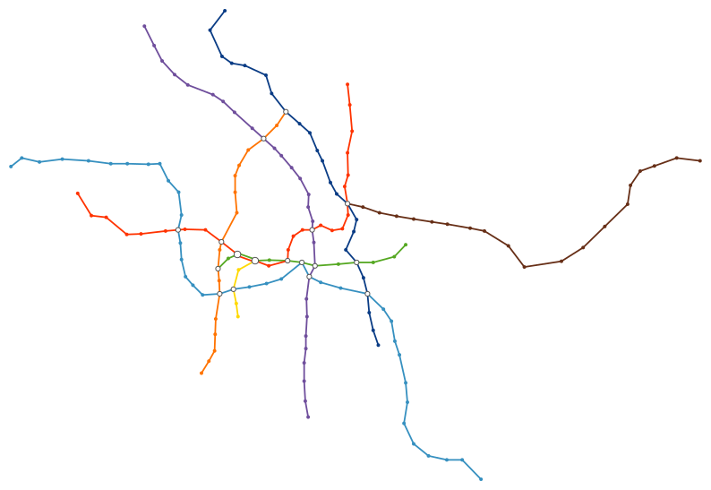

# svg-transit-map

Draw an SVG transit map for a given transport network graph with position information. Consumes data in the [JSON Graph Format](http://jsongraphformat.info), see [the usage section](#usage).

Code forked from [derhuerst/generate-vbb-transit-map](https://github.com/derhuerst/generate-vbb-transit-map).

[](https://www.npmjs.com/package/svg-transit-map)
[](https://david-dm.org/juliuste/svg-transit-map)
[](license)
[](https://gitter.im/juliuste)

## Installation

```shell
npm install -g svg-transit-map
```

## Usage

From the command line:

```shell
Usage:
    svg-transit-map

Options:
    -y --invert-y Invert the Y axis

Examples:
    cat graph.json | svg-transit-map -y > map.svg
```

Where `graph.json` containts a graph object with three attributes:

```js
{
    nodes: [ // list of all nodes
        {
            id: "900000042101", // required
            metadata: {
                x: 537.029, // x-coordinate in any metric, required
                y: 673.576 // y-coordinate in any metric, required, see also the --invert-y option
            }
        }
        // …
    ],
    edges: [ // list of all edges
        {
            // the direction of the edge will be ignored, source and target are therefore interchangeable
            source: "900000120025", // node id, required
            target: "900000120008", // node id, required
            metadata: {
                lines :["U5","U6"] // list of line ids, required. please note that parallel lines must be modeled as one edge with two metadata.lines entries
            }
        }
        // …
    ],
    lines: [ // additional information for lines. if lines are not found in this list, default colour / group will be applied
        {
            id: 'U6', // line id, required
            color: '#456', // line colour, optional
            group: 'U6' // line group id, optional. lines with the same group id will be merged info one for sections where they run in parallel
        }
        // …
    ]
}
```

## Example

For the U-Bahn Berlin graph in `example/berlin.json` and this command:

```shell
    cat example/berlin.json | svg-transit-map -y > example/berlin.svg
```

We get the following output



## Contributing

If you found a bug, want to propose a feature or feel the urge to complain about your life, feel free to visit [the issues page](https://github.com/juliuste/svg-transit-map/issues).
